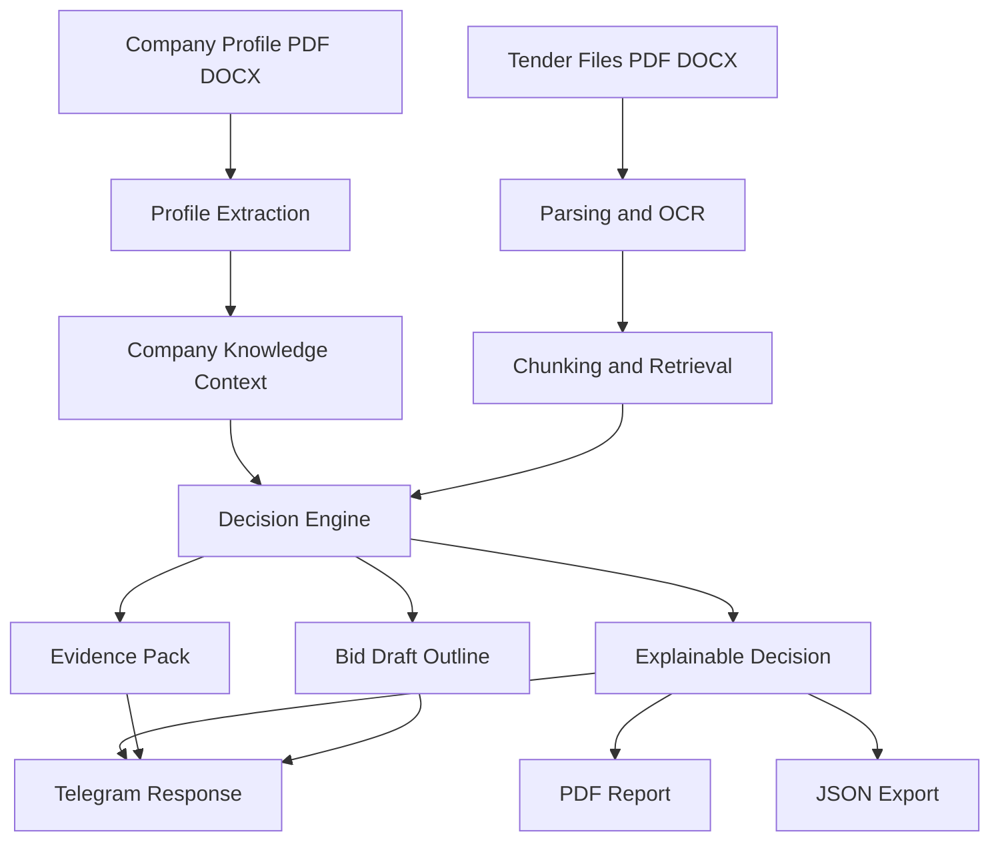

# Tender Copilot

Telegram-first AI product for deep tender analysis, supplier-company matching, and bid draft preparation.

AI-продукт в формате Telegram-first для углубленного анализа тендеров, сопоставления тендера с профилем компании-поставщика и подготовки черновика заявки.

Tender Copilot is not a generic chatbot. It is a workflow product for suppliers who need to decide whether to participate in a tender, understand the risks, and accelerate application preparation using RAG, OCR, explainable scoring, and company-context reasoning.

Tender Copilot — это не обычный чат-бот. Это workflow-продукт для поставщиков, которым нужно понять, стоит ли участвовать в тендере, где находятся риски и как ускорить подготовку заявки с помощью RAG, OCR, интерпретируемого скоринга и контекста компании.

## Product Value

The product helps a supplier answer four practical questions:

1. Does this tender fit our company profile?
2. What is missing or risky in the tender documents?
3. What evidence in the documents supports the decision?
4. How should we structure the draft application?

Продукт помогает поставщику ответить на четыре практических вопроса:

1. Подходит ли этот тендер под профиль нашей компании?
2. Чего не хватает в тендерных документах и какие там есть риски?
3. Какие доказательства в документах подтверждают решение?
4. Как должна быть структурирована заявка на участие?

## What The System Analyzes

## Что анализирует система

### 1. Company profile
The bot can take a full company document in `PDF/DOCX` and extract:
- what the company does
- domains and narrow specializations
- past projects and relevant cases
- geography of work
- financial limits
- required certificates and licenses
- stop factors and commercial constraints

This profile becomes long-term context for the user and is used in both decisioning and bid drafting.

### 1. Профиль компании
Бот может принять полный документ о компании в формате `PDF/DOCX` и извлечь из него:
- чем занимается компания
- домены и узкие специализации
- прошлые проекты и релевантные кейсы
- географию работы
- финансовые ограничения
- обязательные сертификаты и лицензии
- стоп-факторы и коммерческие ограничения

Этот профиль становится долгосрочным контекстом пользователя и используется как при принятии решения, так и при формировании черновика заявки.

### 2. Tender package
The bot can analyze one or several tender files in `PDF/DOCX` and extract:
- tender subject
- contract value / price hints
- deadlines
- certificates and entry requirements
- regions
- obligations and deliverables
- payment terms
- special terms and evaluation criteria

### 2. Пакет тендерных документов
Бот может анализировать один или несколько тендерных файлов в формате `PDF/DOCX` и извлекать:
- предмет тендера
- сумму контракта / ценовые ориентиры
- сроки подачи
- сертификаты и требования допуска
- регионы
- обязательства и состав работ / поставки
- условия оплаты
- специальные условия и критерии оценки

### 3. User draft application
If the user uploads an existing draft application, the system prioritizes it as the base for the generated outline. If no draft is provided, Tender Copilot builds a structured template and explicitly lists what is missing.

### 3. Черновик заявки пользователя
Если пользователь загружает свой готовый черновик заявки, система использует его как приоритетную основу для структуры. Если черновика нет, Tender Copilot строит шаблонную структуру и явно показывает, чего не хватает.

## Core Features

- Telegram-first UX with step-by-step flow
- Company profile onboarding: manual wizard or profile document upload
- Multi-file tender ingestion (`PDF/DOCX`)
- OCR fallback for scanned PDFs
- Deep RAG over tender files and company context
- Explainable `GO / REVIEW / NO_GO` decision
- Evidence output with file, fragment, and quote
- Bid draft outline generation
- PDF export for business users
- JSON export for integrations
- PostgreSQL persistence
- Redis-backed session state
- LLM integration with fallback to heuristic mode

## Ключевые возможности

- Telegram-first UX с пошаговым сценарием
- настройка профиля компании: мастер вручную или загрузка документа о компании
- анализ нескольких тендерных файлов (`PDF/DOCX`)
- OCR fallback для сканированных PDF
- глубокий RAG по тендерным документам и контексту компании
- объяснимое решение `GO / REVIEW / NO_GO`
- вывод доказательств с файлом, фрагментом и цитатой
- генерация черновика структуры заявки
- PDF-экспорт для бизнеса
- JSON-экспорт для интеграций
- хранение данных в PostgreSQL
- сессии пользователя в Redis
- интеграция с LLM с fallback на эвристический режим

## Decision Model

Tender Copilot does not return a black-box answer. It returns an interpretable scorecard.

Tender Copilot не возвращает black-box ответ. Он возвращает интерпретируемую систему оценки.

### Decision statuses
- `GO` — participation is reasonable
- `REVIEW` — manual review is required because data or evidence is incomplete
- `NO_GO` — there are strong blockers for participation

### Статусы решения
- `GO` — участие выглядит разумным
- `REVIEW` — нужна ручная проверка, потому что данных или доказательств недостаточно
- `NO_GO` — есть сильные блокеры для участия

### Interpretable metrics
- `overall_score` — final aggregate score
- `fit_score` — how well the company matches the tender
- `completeness_score` — how complete the extracted tender information is
- `evidence_score` — how strong the textual evidence is
- `risk_score` — participation risk level

### Интерпретируемые метрики
- `overall_score` — итоговый агрегированный балл
- `fit_score` — насколько компания соответствует тендеру
- `completeness_score` — насколько полно извлечена информация из тендерных документов
- `evidence_score` — насколько сильны текстовые доказательства
- `risk_score` — уровень риска участия

This structure makes the product reusable across different client companies because the score is not tied to one specific business; it is tied to a transparent evaluation framework.

Такая структура делает продукт переиспользуемым для разных компаний-клиентов, потому что оценка завязана не на один конкретный бизнес, а на прозрачную рамку анализа.

## How It Works

## Как это работает



## User Flow

1. `Настроить компанию` or `Профиль файлом`
2. `Новый тендер`
3. Upload one or several tender files
4. Click `Готово, анализировать`
5. Review:
- `Показать решение`
- `Доказательства`
- `Черновик заявки`
- `Скачать PDF отчет`
- `Скачать JSON`

## Пользовательский сценарий

1. `Настроить компанию` или `Профиль файлом`
2. `Новый тендер`
3. Загрузить один или несколько тендерных файлов
4. Нажать `Готово, анализировать`
5. Изучить результат:
- `Показать решение`
- `Доказательства`
- `Черновик заявки`
- `Скачать PDF отчет`
- `Скачать JSON`

## Repository Structure

## Структура репозитория

### Directions
Product rules, constraints, KPI, and decision SOP are documented in:
- `directions/product-directions.md`
- `directions/decision-sop.md`

### Directions
Продуктовые правила, ограничения, KPI и SOP принятия решения описаны в:
- `directions/product-directions.md`
- `directions/decision-sop.md`

### Orchestration
Schemas and pipeline design are documented in:
- `orchestration/pipeline-plan.md`
- `orchestration/data-contracts.md`

### Orchestration
Схемы данных и дизайн пайплайна описаны в:
- `orchestration/pipeline-plan.md`
- `orchestration/data-contracts.md`

### Execution
Main implementation lives in:
- `execution/app/telegram/bot.py`
- `execution/app/services/pipeline.py`
- `execution/app/services/decision_engine.py`
- `execution/app/services/parsers.py`
- `execution/app/services/bid_writer.py`

### Execution
Основная реализация находится в:
- `execution/app/telegram/bot.py`
- `execution/app/services/pipeline.py`
- `execution/app/services/decision_engine.py`
- `execution/app/services/parsers.py`
- `execution/app/services/bid_writer.py`

## Tech Stack

- Python 3.13
- Aiogram
- Pydantic
- OpenAI-compatible API (`polza.ai`)
- PostgreSQL
- Redis
- PyMuPDF + pytesseract for OCR
- ReportLab for PDF generation
- Local vector backend with extension points for Qdrant / Pinecone

## Технологический стек

- Python 3.13
- Aiogram
- Pydantic
- OpenAI-compatible API (`polza.ai`)
- PostgreSQL
- Redis
- PyMuPDF + pytesseract для OCR
- ReportLab для генерации PDF
- локальный vector backend с возможностью расширения до Qdrant / Pinecone

## Reliability

The system is designed to fail safely:
- LLM failure does not stop the pipeline
- retrieval issues degrade to `REVIEW`
- critical failures generate a safe fallback decision
- audit logs are written for runs
- run metadata includes stages, duration, and warnings

## Надежность

Система спроектирована так, чтобы безопасно деградировать при сбоях:
- сбой LLM не останавливает весь пайплайн
- проблемы retrieval переводят результат в `REVIEW`
- критические ошибки создают безопасный fallback-результат
- по каждому запуску ведется audit log
- метаданные запуска включают этапы, длительность и предупреждения

## Evaluation

Current baseline on the included eval set:
- `status_accuracy`: `1.0`
- `avg_confidence`: `0.773`
- `evidence_coverage`: `1.0`
- `avg_cost_estimate_rub`: `0.18`

## Оценка качества

Текущий baseline на встроенном eval-наборе:
- `status_accuracy`: `1.0`
- `avg_confidence`: `0.773`
- `evidence_coverage`: `1.0`
- `avg_cost_estimate_rub`: `0.18`

## Local Run

```powershell
cd execution
python -m venv .venv_fix
.\.venv_fix\Scripts\python.exe -m pip install -r requirements.txt
Copy-Item .env.example .env
.\.venv_fix\Scripts\python.exe main.py
```

## Локальный запуск

```powershell
cd execution
python -m venv .venv_fix
.\.venv_fix\Scripts\python.exe -m pip install -r requirements.txt
Copy-Item .env.example .env
.\.venv_fix\Scripts\python.exe main.py
```

## Environment

Required / supported variables:
- `TELEGRAM_BOT_TOKEN`
- `OPENAI_API_KEY`
- `OPENAI_BASE_URL`
- `OPENAI_MODEL`
- `DATABASE_URL`
- `REDIS_URL`
- `ENABLE_OCR`
- `TESSERACT_CMD`

## Переменные окружения

Обязательные / поддерживаемые переменные:
- `TELEGRAM_BOT_TOKEN`
- `OPENAI_API_KEY`
- `OPENAI_BASE_URL`
- `OPENAI_MODEL`
- `DATABASE_URL`
- `REDIS_URL`
- `ENABLE_OCR`
- `TESSERACT_CMD`

## Portfolio Positioning

This project demonstrates a hybrid profile.

Этот проект демонстрирует гибридный профиль.

### AI Specialist
- RAG design
- document ingestion
- OCR integration
- explainable decision logic
- LLM fallback patterns
- production-minded persistence and session handling

### AI Specialist
- проектирование RAG
- ingestion документов
- интеграция OCR
- объяснимая логика принятия решений
- fallback-паттерны для LLM
- production-minded хранение данных и управление сессиями

### AI Product / Project Manager
- product scoping
- decision framework design
- explainability as product requirement
- user-flow design in Telegram
- KPI and evaluation framing
- business-oriented output format (decision, evidence, report, draft)

### AI Product / Project Manager
- product scoping
- проектирование decision framework
- explainability как продуктовое требование
- проектирование пользовательского сценария в Telegram
- формулировка KPI и рамки оценки качества
- бизнес-ориентированный формат результата (decision, evidence, report, draft)

## Why This Project Is Strong For Portfolio

It is not just another chatbot demo.

It shows:
- real business workflow automation
- structured AI decisioning
- explainability
- product thinking
- production concerns
- integration-ready architecture

## Почему этот проект сильный для портфолио

Это не просто еще один demo-бот.

Он показывает:
- автоматизацию реального бизнес-процесса
- структурированное AI decisioning
- explainability
- продуктовое мышление
- production-аспекты
- архитектуру, готовую к интеграциям

## Current Limitations

- v1 focuses on Russian-language workflow
- no website scraping of tender platforms
- OCR quality depends on scan quality
- the local vector backend is baseline quality; Qdrant/Pinecone are extension paths
- this is an advisory assistant, not legal advice

## Текущие ограничения

- v1 сфокусирован на русскоязычном workflow
- нет скрейпинга тендерных площадок
- качество OCR зависит от качества скана
- локальный vector backend дает базовое качество; Qdrant/Pinecone предусмотрены как путь развития
- это advisory assistant, а не юридическое заключение

## Next Iterations

- better domain-specific scoring profiles
- stronger retrieval reranking
- richer extraction from tender tables
- human-in-the-loop review UI
- CRM integrations
- analytics dashboard for runs and conversion to bid submission

## Следующие итерации

- более сильные доменно-специфичные scoring profiles
- более качественный retrieval reranking
- более глубокое извлечение данных из тендерных таблиц
- human-in-the-loop review UI
- интеграции с CRM
- аналитический дашборд по запускам и конверсии в подготовку заявки
