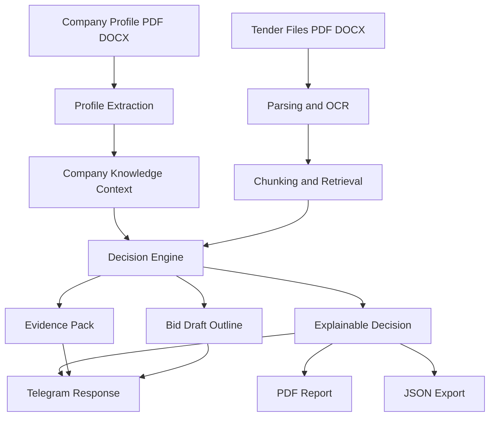

# Tender Copilot

Telegram-first AI product for deep tender analysis, supplier-company matching, and bid draft preparation.

Tender Copilot is not a generic chatbot. It is a workflow product for suppliers who need to decide whether to participate in a tender, understand the risks, and accelerate application preparation using RAG, OCR, explainable scoring, and company-context reasoning.

## Product Value

The product helps a supplier answer four practical questions:

1. Does this tender fit our company profile?
2. What is missing or risky in the tender documents?
3. What evidence in the documents supports the decision?
4. How should we structure the draft application?

## What The System Analyzes

### 1. Company profile
The bot can take a full company document in `PDF/DOCX` and extract:
- what the company does
- domains and narrow specializations
- past projects and relevant cases
- geography of work
- financial limits
- required certificates and licenses
- stop factors and commercial constraints

This profile becomes long-term context for the user and is used in both decisioning and bid drafting.

### 2. Tender package
The bot can analyze one or several tender files in `PDF/DOCX` and extract:
- tender subject
- contract value / price hints
- deadlines
- certificates and entry requirements
- regions
- obligations and deliverables
- payment terms
- special terms and evaluation criteria

### 3. User draft application
If the user uploads an existing draft application, the system prioritizes it as the base for the generated outline. If no draft is provided, Tender Copilot builds a structured template and explicitly lists what is missing.

## Core Features

- Telegram-first UX with step-by-step flow
- Company profile onboarding: manual wizard or profile document upload
- Multi-file tender ingestion (`PDF/DOCX`)
- OCR fallback for scanned PDFs
- Deep RAG over tender files and company context
- Explainable `GO / REVIEW / NO_GO` decision
- Evidence output with file, fragment, and quote
- Bid draft outline generation
- PDF export for business users
- JSON export for integrations
- PostgreSQL persistence
- Redis-backed session state
- LLM integration with fallback to heuristic mode

## Decision Model

Tender Copilot does not return a black-box answer. It returns an interpretable scorecard.

### Decision statuses
- `GO` — participation is reasonable
- `REVIEW` — manual review is required because data or evidence is incomplete
- `NO_GO` — there are strong blockers for participation

### Interpretable metrics
- `overall_score` — final aggregate score
- `fit_score` — how well the company matches the tender
- `completeness_score` — how complete the extracted tender information is
- `evidence_score` — how strong the textual evidence is
- `risk_score` — participation risk level

This structure makes the product reusable across different client companies because the score is not tied to one specific business; it is tied to a transparent evaluation framework.

## How It Works



## User Flow

1. `Настроить компанию` or `Профиль файлом`
2. `Новый тендер`
3. Upload one or several tender files
4. Click `Готово, анализировать`
5. Review:
- `Показать решение`
- `Доказательства`
- `Черновик заявки`
- `Скачать PDF отчет`
- `Скачать JSON`

## Repository Structure

### Directions
Product rules, constraints, KPI, and decision SOP are documented in:
- `directions/product-directions.md`
- `directions/decision-sop.md`

### Orchestration
Schemas and pipeline design are documented in:
- `orchestration/pipeline-plan.md`
- `orchestration/data-contracts.md`

### Execution
Main implementation lives in:
- `execution/app/telegram/bot.py`
- `execution/app/services/pipeline.py`
- `execution/app/services/decision_engine.py`
- `execution/app/services/parsers.py`
- `execution/app/services/bid_writer.py`

## Tech Stack

- Python 3.13
- Aiogram
- Pydantic
- OpenAI-compatible API (`polza.ai`)
- PostgreSQL
- Redis
- PyMuPDF + pytesseract for OCR
- ReportLab for PDF generation
- Local vector backend with extension points for Qdrant / Pinecone

## Reliability

The system is designed to fail safely:
- LLM failure does not stop the pipeline
- retrieval issues degrade to `REVIEW`
- critical failures generate a safe fallback decision
- audit logs are written for runs
- run metadata includes stages, duration, and warnings

## Evaluation

Current baseline on the included eval set:
- `status_accuracy`: `1.0`
- `avg_confidence`: `0.773`
- `evidence_coverage`: `1.0`
- `avg_cost_estimate_rub`: `0.18`

## Local Run

```powershell
cd execution
python -m venv .venv_fix
.\.venv_fix\Scripts\python.exe -m pip install -r requirements.txt
Copy-Item .env.example .env
.\.venv_fix\Scripts\python.exe main.py
```

## Environment

Required / supported variables:
- `TELEGRAM_BOT_TOKEN`
- `OPENAI_API_KEY`
- `OPENAI_BASE_URL`
- `OPENAI_MODEL`
- `DATABASE_URL`
- `REDIS_URL`
- `ENABLE_OCR`
- `TESSERACT_CMD`

## Portfolio Positioning

This project demonstrates a hybrid profile.

### AI Specialist
- RAG design
- document ingestion
- OCR integration
- explainable decision logic
- LLM fallback patterns
- production-minded persistence and session handling

### AI Product / Project Manager
- product scoping
- decision framework design
- explainability as product requirement
- user-flow design in Telegram
- KPI and evaluation framing
- business-oriented output format (decision, evidence, report, draft)

## Why This Project Is Strong For Portfolio

It is not just another chatbot demo.

It shows:
- real business workflow automation
- structured AI decisioning
- explainability
- product thinking
- production concerns
- integration-ready architecture

## Current Limitations

- v1 focuses on Russian-language workflow
- no website scraping of tender platforms
- OCR quality depends on scan quality
- the local vector backend is baseline quality; Qdrant/Pinecone are extension paths
- this is an advisory assistant, not legal advice

## Next Iterations

- better domain-specific scoring profiles
- stronger retrieval reranking
- richer extraction from tender tables
- human-in-the-loop review UI
- CRM integrations
- analytics dashboard for runs and conversion to bid submission
